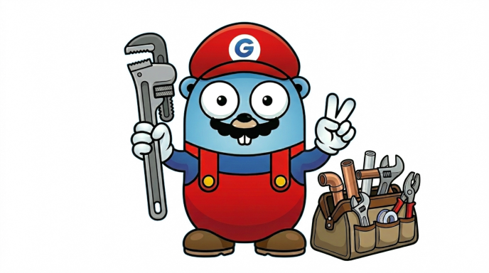

# plumber

A library to manage application dependency graph and orchestrate service tasks.

## Contributing

Please read the [CONTRIBUTING.md](CONTRIBUTING.md) document for guidelines on developing and contributing changes.

## High-level Overview

### Service dependency management

Declarative dependency resolution that eliminates repetitive error checking during construction. Dependencies are built once and reused across the application graph.

[Read more](docs/dependency-management.md)

### Service task orchestration

Lifecycle management for multi-layered applications. Start tasks in a defined order using serial pipelines or run independent tasks in parallel, with graceful shutdown in reverse order.

[Read more](docs/task-orchestration.md)

### Code manipulation

Annotation-driven code generation over Go source files. Scan packages for `plumber:*` comment annotations, then generate new Go files or merge derived fields into existing structs.

- [Shape command](docs/shape.md) -- annotation-driven code generation
- [Inspect command](docs/inspect.md) -- structured type information output
